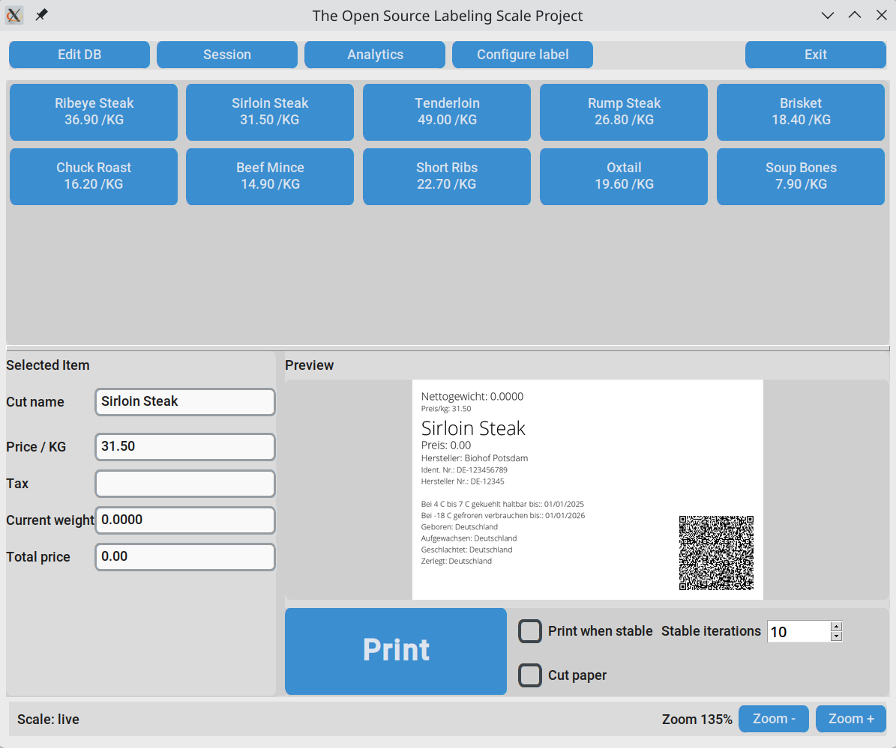

# The Open Source Labeling Scale Project (OSLS)

OSLS is a practical, open source labeling scale workflow for small farms, butcheries, and food shops.

It combines:
- live scale input
- configurable cut presets
- editable session metadata
- label preview and printing (Brother QL)
- print analytics and log export
- Works on Linux and macOS

## Screenshot



## Why We Need an Open Source Labeling Scale System

Most retail labeling scale ecosystems are proprietary end-to-end:
- proprietary hardware
- proprietary software licenses
- expensive service contracts
- vendor lock-in for labels, updates, integrations, and support

For small farms and independent shops, this often means high recurring costs and limited control over their own workflow. In practice, many businesses pay significantly more than the technical value of basic features like product presets, print layouts, and reporting.

OSLS exists to democratize this tooling:
- transparent code
- no license lock-in
- hardware/software choice
- community-driven improvements
- local ownership of business data

The goal is simple: give small operators control over labeling infrastructure without being trapped by closed vendor stacks.

## Features

- Full-window cut button grid (5 buttons per row)
- Edit DB dialog:
- add/edit/delete cuts
- reorder items
- load/save cut lists
- Session dialog:
- farm metadata fields
- load/save session profiles
- automatic default session persistence
- Label configuration dialog:
- show/hide fields
- rename field labels
- font size per field
- move fields up/down
- add/remove empty spacer lines
- global line spacing control
- load/save label layout JSON
- Live scale reading from serial
- Optional auto-print when scale value is stable for N iterations
- Total price calculation from `price_per_kg * current_weight`
- Print log analytics:
- summary by cut
- full print log
- totals
- reset button archives old log to `logs/` and starts fresh
- Printed label images saved under `printed_labels/`

## Requirements

- Python 3.11+ (tested on Fedora Linux)
- Brother QL printer supported by `brother_ql`
- USB scale providing serial weight lines containing `kg`

Python packages used by the app include:
- `customtkinter`
- `Pillow`
- `qrcode`
- `pyserial`
- `brother_ql`

## Setup

```bash
python -m venv venv
source venv/bin/activate
pip install -r requirements.txt
```

## Configuration Files

- `config/printer_config.json`: printer backend + identifier
- `config/cuts_db.json`: cut presets
- `config/label_config.json`: label layout settings
- `config/session_default.json`: auto-saved session defaults

### Example `config/printer_config.json`

```json
{
  "connection_mode": "usb",
  "usb": {
    "backend": "pyusb",
    "identifier": "usb://0x04f9:0x209c"
  }
}
```

## Run

```bash
./label.py
```

## Known Linux USB Note (Fedora)

If you see intermittent `Resource busy` while printing, `ipp-usb` may be competing for the same printer interface.

You can blacklist the Brother device in `ipp-usb` quirks or disable `ipp-usb` if you only use direct `pyusb` printing.

## License

See `LICENSE`.
